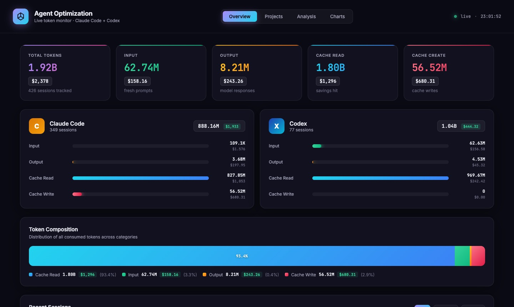
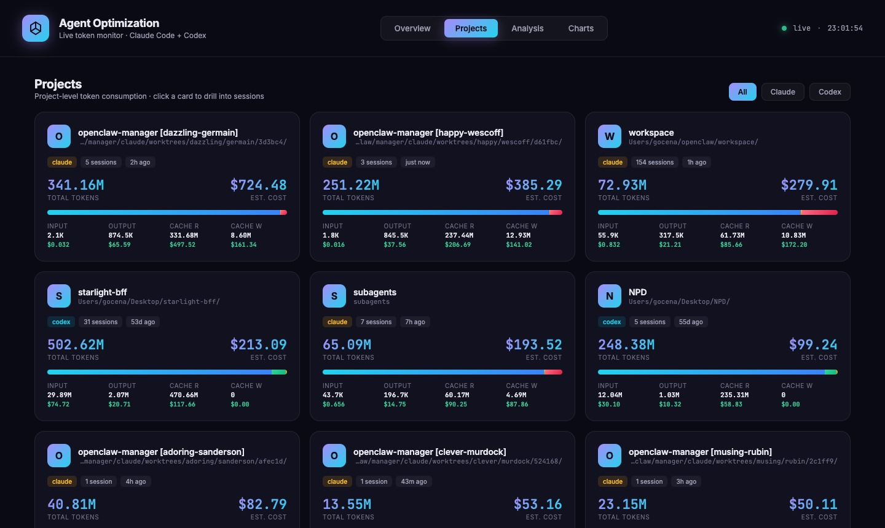
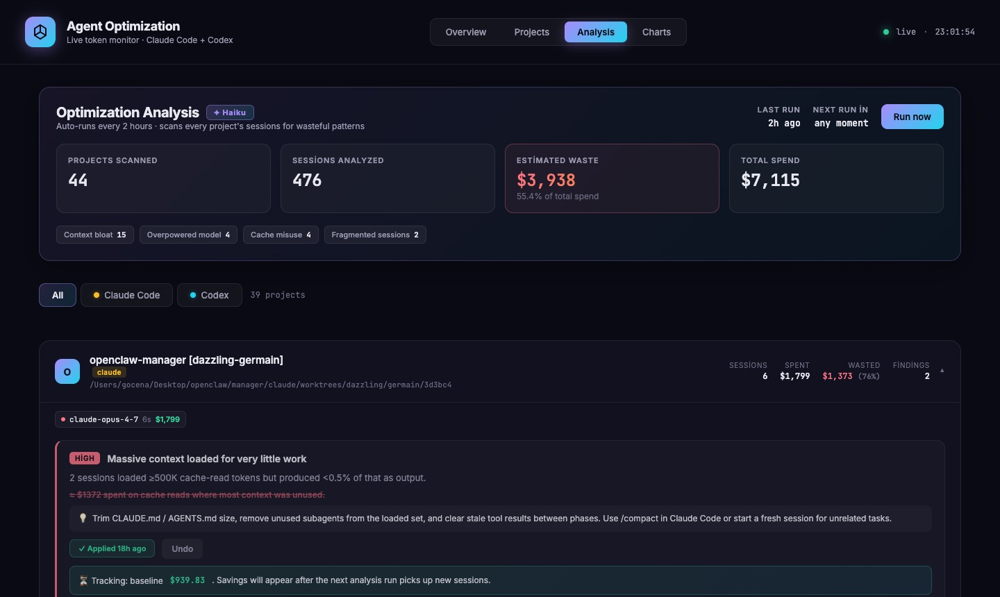
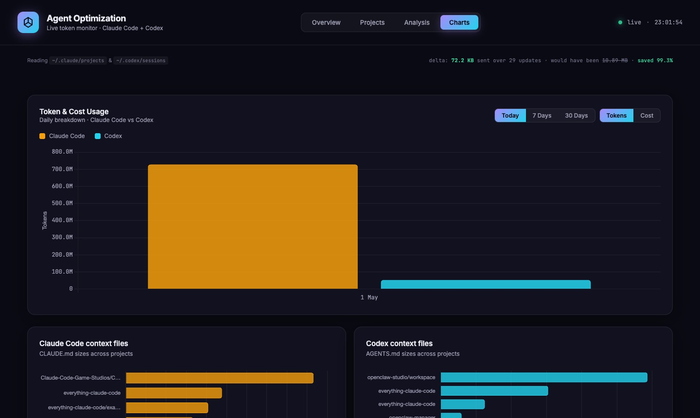

# Agent Optimization

> **Live token & cost monitor for Claude Code and Codex sessions.**  
> Tracks every API call you make, finds what's wasting money, and lets you fix it — automatically.

---

## What is this?

If you use Claude Code or Codex heavily, your token spend compounds fast — long sessions, large context files, wrong models for the job, keepalive probes eating cache writes. This dashboard reads your local session files in real time, quantifies the waste, and gives you actionable fixes.

Built for people who ship with AI agents every day and want to stay in control of the cost.

---

## Features

### 📊 Overview — Live token dashboard
Real-time breakdown of every token you've consumed across Claude Code and Codex sessions.

- **5 KPI cards** — Total tokens · Input · Output · Cache Read · Cache Create, each with USD cost
- **Agent split** — Claude Code vs Codex side-by-side bar charts with per-category cost
- **Token composition** — Stacked bar showing exactly where your budget goes
- **Session table** — Filterable by source, sorted by recency, with per-session cost breakdown

### 🗂 Projects — Project-level drill-down
Group sessions by project. Click into any project to see every session that ran inside it.

- Cost and token totals per project, sorted by spend
- Cache hit ratio, output share, avg cost/session
- Per-session table with session name (first user message), model, all token buckets + cost

### 🔬 Analysis — LLM-powered waste detection
Every 2 hours, GPT 5.4 mini analyzes your projects using aggregated token statistics. Set `OPENAI_API_KEY` to enable LLM recommendations; without it, the dashboard falls back to heuristic analysis.

**Detected patterns:**
- 🔴 Context bloat — loading huge context for minimal output
- 🔴 Cache inefficiency — writing cache blocks that never get reused
- 🟡 Overpowered model — using Opus on tasks Sonnet would handle equally well
- 🟡 Output-heavy sessions — verbose generation that drives up the most expensive token type
- 🟡 Codex reasoning waste — reasoning tokens vastly outnumbering visible output
- 🔵 Fragmented sessions — too many tiny sessions losing cached context on every restart

Each finding includes a **projected savings estimate**, a concrete recommendation, and example sessions. For actionable findings (model pinning, CLAUDE.md trim, Codex reasoning config), you can **apply the fix directly** from the UI — the tool writes the change and creates a timestamped backup.

### 📈 Charts — Usage over time + context file sizes

- **Token & cost usage** — grouped bar chart by day, toggle between Tokens / Cost and Today / 7 Days / 30 Days
- **Claude context files** — horizontal bar chart of every `CLAUDE.md` across your projects, sized by byte count
- **Codex context files** — same for `AGENTS.md`

### ⚡ Delta WebSocket updates
The dashboard never sends a full payload twice. Only changed sessions are pushed on each update — typically **99%+ bandwidth reduction** vs naive full-refresh, visible in the footer.

---

## Screenshots

**Overview** — live KPIs with USD cost per token category, Claude Code vs Codex split, token composition bar


**Projects** — every project as a card with tokens, cost, composition bar and per-category breakdown


**Analysis** — GPT-powered waste detection, per-project findings with severity, impact $ and apply button


**Charts** — daily token/cost bar chart (Today / 7 Days / 30 Days) and context file size inventory


---

## Quickstart

### Prerequisites

- **macOS** (LaunchAgent auto-start) — Linux works too, skip the LaunchAgent step
- **[OrbStack](https://orbstack.dev)** or **Docker Desktop**
- **Node.js 22+** (for local dev only — Docker has its own)
- Claude Code or Codex installed and used at least once

### Option A — Docker (recommended, runs on startup)

```bash
git clone https://github.com/gocenalper/agent-optimization
cd agent-optimization

# Run setup: builds Docker image, installs LaunchAgent, opens browser
bash setup.sh
```

The setup script:
1. Starts OrbStack / Docker if not running
2. Builds the image and launches the container (`restart: always`)
3. Installs a macOS LaunchAgent so the container auto-starts on every login
4. Opens `http://localhost:4317` in your browser

### Option B — Local dev (no Docker)

```bash
git clone https://github.com/gocenalper/agent-optimization
cd agent-optimization
npm install
npm run dev
# → http://localhost:4317
```

---

## LLM Analysis setup (optional but recommended)

The Analysis page uses OpenAI's Responses API with `gpt-5.4-mini` by default.

Create `.env` from the example and set your API key:

```bash
cp .env.example .env
# edit .env:
# OPENAI_API_KEY=sk-...
# OPENAI_ANALYSIS_MODEL=gpt-5.4-mini
```

If the analysis shows `⚙ Heuristic` instead of `✦ gpt-5.4-mini`, the OpenAI key is missing or the analysis request failed.

---

## How it works

```
~/.claude/projects/**/*.jsonl   ──┐
                                  ├──► server.js parses & aggregates
~/.codex/sessions/**/*.jsonl    ──┘         │
                                            │  file watcher (chokidar)
                                            ▼
                              incremental parse cache
                              (only changed files re-read)
                                            │
                              ┌─────────────┴──────────────┐
                              │   Express + WebSocket       │
                              │   delta patches only        │
                              └─────────────┬──────────────┘
                                            │
                              ┌─────────────▼──────────────┐
                              │   Browser dashboard         │
                              │   plain JS, no framework    │
                              │   Chart.js for charts       │
                              └────────────────────────────┘

Every 2h:  OpenAI Responses API (gpt-5.4-mini) ──► per-project analysis
           results cached, delta-pushed via WebSocket
```

Session files are read locally. The only outbound analysis traffic sends aggregated stats (no conversation content) to OpenAI when `OPENAI_API_KEY` is configured.

---

## Docker details

```yaml
# docker-compose.yml (simplified)
services:
  agent-optimization:
    restart: always                    # auto-restarts with OrbStack
    ports: ["4317:4317"]
    volumes:
      - /Users/${USER}:/host-home      # read your session files
    environment:
      - HOST_HOME=/host-home
      - USE_POLLING=true               # reliable on Mac FUSE volumes
```

File watching uses polling inside Docker (`USE_POLLING=true`) because Mac's FUSE filesystem layer doesn't propagate inotify events into containers.

---

## Configuration

| File | Purpose |
|---|---|
| `.env` | `OPENAI_API_KEY` and optional `OPENAI_ANALYSIS_MODEL` |
| `pricing.js` | Token rates per model — update when providers change pricing |
| `docker-compose.yml` | Port, volume mounts, polling interval |
| `com.agent-optimization.plist` | macOS LaunchAgent definition |

### Supported models (pricing)

Claude Opus 4/3.5/3 · Claude Sonnet 4/3.5/3 · Claude Haiku 4/3.5/3 · GPT-5 · GPT-5.4 mini · GPT-4o · GPT-4.1 · o1 · o3 · o4-mini · Codex-mini

Unknown models fall back to Sonnet-tier pricing with a `≈` indicator.

---

## Updating

```bash
cd ~/Desktop/agent-optimization
git pull
docker compose up -d --build   # rebuilds image with new code
```

---

## Why not just use the Anthropic dashboard?

| | Anthropic dashboard | This |
|---|---|---|
| Granularity | Per-month aggregate | Per-session, per-message |
| Codex | ✗ | ✓ |
| Project grouping | ✗ | ✓ |
| Waste detection | ✗ | ✓ (LLM-powered) |
| Auto-apply fixes | ✗ | ✓ |
| Real-time | ✗ | ✓ (WebSocket) |
| Offline / private | ✗ | ✓ (reads local files) |
| Cost | Included in plan | Free to run |

---

## Stack

- **Runtime:** Node.js 22, ES modules
- **Server:** Express + `ws` WebSocket + `chokidar` file watcher
- **Frontend:** Vanilla JS, Chart.js — no build step, no framework
- **Container:** Docker / OrbStack, `node:22-alpine`
- **Analysis:** OpenAI Responses API (`gpt-5.4-mini` by default)

---

## License

MIT
